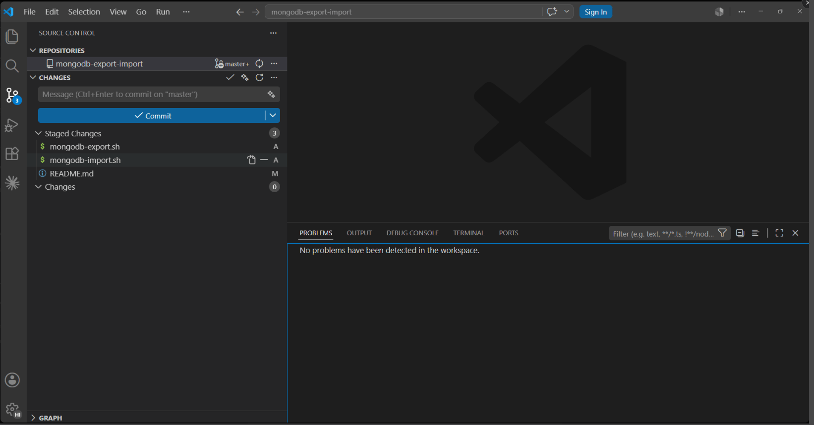

# Claude Commit Preview

> **Preview your Claude commit message before you commit or push** — AI-generated, in your repo's own style, fully editable in VS Code's Source Control box. Powered by the Claude Code CLI.

[](https://marketplace.visualstudio.com/items?itemName=hiren-ghodasara.claude-commit-preview)
[](https://marketplace.visualstudio.com/items?itemName=hiren-ghodasara.claude-commit-preview)
[](LICENSE)

---

## See It in Action



Stage your changes, click ✨, and Claude fills your commit message box instantly.  
**Read it. Edit it if you want. Then commit.**

---

## Why Claude Commit Preview?

Most AI commit tools commit blindly — you don't see what's being written until it's done.  
**Claude Commit Preview puts you in the driver's seat.**

1. Claude reads your staged diff, branch, and recent history using the Claude Code CLI already on your machine
2. It writes a commit message **in your repository's own style** — and drops it into the Source Control input box, visible and editable
3. You choose: **Commit Now** or **Edit First**

You always review before anything is committed. No surprises, no blind pushes.

---

## How It Works

```
git add (stage changes)
    ↓
Click ✨ in Source Control toolbar
    ↓
Claude reads your staged diff + branch + recent commits via Claude CLI
    ↓
Commit message appears in the SCM input box   ← you can read & edit here
    ↓
"Commit Now"  or  "Edit First"  — your choice
```

This mirrors the official [`/commit-commands:commit`](https://github.com/anthropics/claude-code/tree/main/plugins/commit-commands) workflow — **but it previews instead of committing**, so the final commit is always your call.

---

## What the Message Looks Like

Claude writes the whole message — subject, body, ticket, and co-author trailer — matching the conventions it sees in your recent commits:

```
feat: support agent run cancellation [SP-15404]

Add cancelled activity status and sync linked activity status from run
items, treating cancellation as final so a racing worker write cannot
revive a cancelled item or activity.

Co-Authored-By: Claude <noreply@anthropic.com>
```

- **Conventional Commits subject** focused on *intent*, not a file-by-file dump
- **Ticket tag** (e.g. `[SP-15404]`) inferred from your branch name and recent commit history — no configuration, no regex to maintain
- **Co-Authored-By trailer** written by Claude itself, carrying the actual model name

---

## Requirements

- [Claude Code CLI](https://docs.anthropic.com/en/docs/claude-code) installed and authenticated (`claude --version` should work in your terminal)
- VS Code 1.85+
- A git repository with staged changes (`git add`)

---

## Features

- **Preview your commit message before committing** — written into the SCM box, never committed blindly
- **Matches your repo's commit style** — Claude learns the format from your recent commits, like `/commit-commands:commit`
- **Smart ticket detection** — Jira/Linear tickets (e.g. `SP-123`) inferred from the branch and history, placed in the subject
- **Co-Authored-By trailer** — attribution added automatically (toggleable)
- **Edit before you commit** — full control, always
- **One-click generation** — ✨ sparkle button in the Source Control toolbar
- **No API key required** — reuses your existing Claude Code CLI session
- **Works with any language or framework**
- **Debug output panel** — full step-by-step logs in the Output panel

---

## Ticket Detection

If your branch name contains a ticket number, Claude includes it in the commit subject — and follows whatever bracket convention your recent commits already use:

| Branch name | Subject tag |
|------------|-------------|
| `SP-123` | `[SP-123]` |
| `fix/SP-123` | `[SP-123]` |
| `feat/SP-123-some-description` | `[SP-123]` |
| `main`, `develop` | *(none — no ticket to infer)* |

No allow-list to configure — Claude infers the project key and format from your history.

---

## Extension Settings

| Setting | Default | Description |
|---------|---------|-------------|
| `claudeCommitPreview.addCoAuthor` | `true` | Ask Claude to end the message with its `Co-Authored-By` trailer, matching the `/commit-commands:commit` style. |

---

## Troubleshooting

**✨ button not visible?**
Make sure you have a git repository open and the Source Control panel is active (`Ctrl+Shift+G`).

**"No staged changes found"**
Run `git add <file>` or use the `+` button in Source Control to stage files first.

**Claude CLI error?**
Open the **Output** panel (`Ctrl+Shift+U`) → select **Claude Commit Preview** to see detailed logs.
Make sure `claude` is in your PATH: run `claude --version` in a terminal to verify.

**No ticket in the message?**
Claude infers the ticket from your branch name and recent commits. Branches without a `ABC-123` pattern (like `main` or `develop`) have nothing to infer, and an empty history gives Claude no convention to follow.

---

## Debug Logs

Open the **Output** panel (`Ctrl+Shift+U`) → select **Claude Commit Preview** from the dropdown to see step-by-step logs for every generation attempt.

---

## Contributing

Issues and PRs welcome at [github.com/hiren-ghodasara/claude-commit-preview](https://github.com/hiren-ghodasara/claude-commit-preview).

---

## License

[MIT](LICENSE) © Hiren Ghodasara
